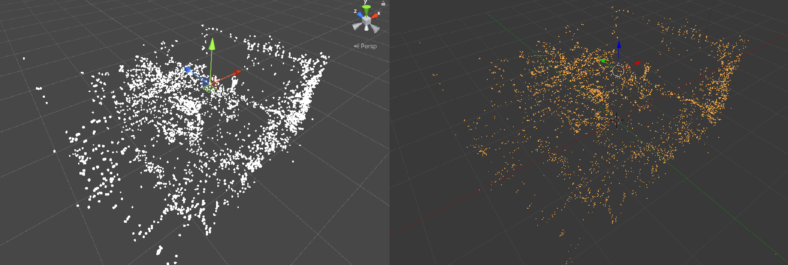
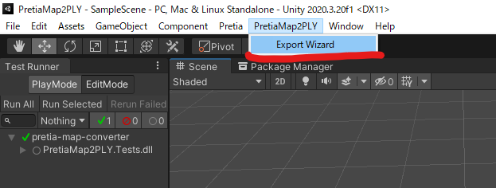
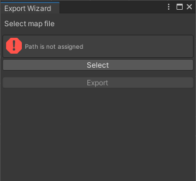

# PretiaMap2PLY

## About

Pretiaのマップファイルを.ply点群ファイルに変換するUnityエディタ拡張です。
CloudCompareとBlender2.79のplyインポータで確認済みです。
座標系の違いによって初期回転がかかっている可能性があります。



## Tested Environments

- Windows 10 Home
- Unity 2020.3.20f1
- Pretia SDK 0.5.1

## Install

本パッケージはPretia SDKに依存しているので、
インストールする前にPretia SDKをインストールしてください。

本パッケージのインストールにはUnity Package Manager(UPM)
を使用します。

### GUIの場合

Pretia SDKをインストールしたうえで、
UPMのウィンドウから「Add package from git URL...」を押下し、
`https://github.com/drumath2237/PretiaMap2PLY.git?path=/Packages/PretiaMap2PLY`を指定します。

### `manifest.json`を編集する場合

`manifest.json`のdependencyに本パッケージのURLを追記します。
この時Pretia SDKよりも下の行にあることを確認してください。

```json :manifest.json
{
  "dependency":{
    "com.pretia.sdk": "0.5.1",
    "com.drumath2237.pretiamap2ply": "https://github.com/drumath2237/PretiaMap2PLY.git?path=/Packages/PretiaMap2PLY",
  }
}
```

## Usage

上部のメニューからPretiaMap2PLY＞Export Wizardを選択します。



するとウィンドウが開くので、
Selectボタンを押して`.map`ファイルを選択し、Exportボタンで保存場所を選択してエクスポートします。



## Contact

何かございましたら[にー兄さんのTwitter](https://twitter.com/ninisan_drumath)
までご連絡ください。
